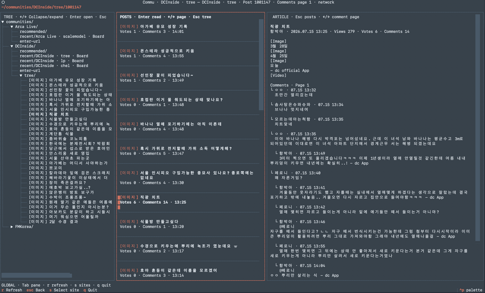

# Commu

**FMKorea**, **DCInside**, **Arca Live**의 공개 게시글을 터미널에서 읽는 read-only TUI입니다.

커뮤니티는 시끄러워도 터미널은 조용하니까요. 브라우저 탭을 하나 더 들키지 않고, 목록부터 본문과 댓글까지 키보드로 둘러볼 수 있습니다.

Commu는 로그인, 글쓰기, 추천, 구독을 지원하지 않습니다. CAPTCHA나 JavaScript/WASM 보안 검증을 해결하거나 우회하지도 않습니다.

## Preview



## Quick Start

가장 간단하고 권장하는 실행 방법은 Docker Compose입니다. Python이나 Playwright를 호스트에 따로 설치할 필요가 없습니다.

### 1. 준비하기

- [Git](https://git-scm.com/)
- [Docker Desktop](https://www.docker.com/products/docker-desktop/) 또는 Docker Compose v2 호환 Docker Engine
- TUI를 표시할 수 있는 터미널

저장소의 **Code** 버튼에서 HTTPS 주소를 복사한 뒤 다음 명령을 실행하세요. `<REPOSITORY_URL>`은 복사한 주소로 바꿉니다.

```bash
git clone <REPOSITORY_URL>
cd terminal_community
```

### 2. 처음 실행하기

저장소 루트에서 이미지를 빌드하고 Commu를 실행합니다.

```bash
docker compose run --rm --build commu
```

첫 빌드는 Playwright와 Chromium이 포함된 기반 이미지를 내려받기 때문에 시간이 조금 걸릴 수 있습니다. 커피 한 모금 정도는 괜찮지만, 새 원두를 볶을 정도는 아닙니다.

### 3. 다음부터 실행하기

```bash
docker compose run --rm commu
```

소스가 변경됐거나 `git pull`로 새 버전을 받은 뒤에는 다시 빌드하세요.

```bash
docker compose run --rm --build commu
```

앱은 `q`로 종료합니다. `--rm`은 실행 컨테이너만 삭제하고 `commu-data` named volume은 유지합니다. 따라서 cache, URL history, browser storage state는 다음 실행에서도 사용됩니다.

## 처음 둘러보기

인자 없이 실행하면 Explorer의 community tree가 열립니다.

1. `↑` / `↓`로 site와 항목 사이를 이동합니다.
2. `←` / `→`로 tree를 접거나 펼칩니다.
3. `Enter`로 site, 추천 board, 최근 URL 또는 post를 엽니다.
4. `Tab`으로 tree, post list, article pane 사이를 이동합니다.
5. 길을 잃었다면 화면 곳곳의 keyboard hint를 보세요. 그래도 길을 잃었다면 `Esc`가 대체로 집 방향입니다.

## 지원 기능

- **FMKorea** 해외축구 board
- **DCInside** 일반·minor·mini gallery
- **Arca Live** 공개 channel
- Post list, article, comments와 replies 표시
- 추천 URL 또는 직접 URL 입력
- 직접 입력한 URL의 최근 기록
- `commu <URL>`을 통한 board·post 바로 열기
- Site와 board가 분리된 local cache
- 이미지와 동영상을 다운로드하지 않는 text-only 화면
- Site별 browser storage state 유지

Commu는 공개 페이지를 읽기만 합니다. 로그인 전용 글, 성인 인증이 필요한 콘텐츠, CAPTCHA 뒤의 페이지는 지원 범위가 아닙니다.

## Keyboard

화면 안에도 현재 context에 맞는 hint가 계속 표시됩니다.

| Key | Action |
| --- | --- |
| `↑` / `↓` | 항목 이동 또는 본문 scroll |
| `←` / `→` | Tree collapse/expand, board page 이동, comment page 이동 |
| `Enter` | 선택하거나 post 열기 |
| `Tab` | Pane focus 이동 |
| `Esc` | 이전 단계, tree 또는 post list로 돌아가기 |
| `r` | 현재 화면 refresh |
| `s` | Site 선택 화면 열기 |
| `q` | Quit |

## URL로 바로 열기

Native 설치에서는 URL을 인자로 넘겨 시작 메뉴를 건너뛸 수 있습니다.

```bash
commu https://www.fmkorea.com/football_world
commu 'https://gall.dcinside.com/board/lists/?id=football_new9'
commu https://arca.live/b/rogersfu
```

Docker Compose에서는 service 이름 뒤에 URL을 추가합니다.

```bash
docker compose run --rm commu https://www.fmkorea.com/football_world
docker compose run --rm commu 'https://gall.dcinside.com/board/lists/?id=football_new9'
docker compose run --rm commu https://arca.live/b/rogersfu
```

Board URL은 post list를, post URL은 해당 article과 comments를 바로 엽니다.

## 추천 URL

- **FMKorea:** `https://www.fmkorea.com/football_world`
- **DCInside:** `https://gall.dcinside.com/board/lists/?id=football_new9`
- **Arca Live:** `https://arca.live/b/rogersfu`

## 지원 URL 형식

HTTPS URL만 지원합니다. `<gallery>`와 `<channel>`은 영문자, 숫자, `_`, `-`로 이루어진 1~80자 식별자이고 `<article>`은 숫자입니다.

- FMKorea board: `https://www.fmkorea.com/football_world`
- FMKorea post: `https://www.fmkorea.com/<article>`
- DCInside 일반 gallery: `https://gall.dcinside.com/board/lists/?id=<gallery>`, `https://gall.dcinside.com/board/view/?id=<gallery>&no=<article>`
- DCInside minor gallery: `https://gall.dcinside.com/mgallery/board/lists/?id=<gallery>`, `https://gall.dcinside.com/mgallery/board/view/?id=<gallery>&no=<article>`
- DCInside mini gallery: `https://gall.dcinside.com/mini/board/lists/?id=<gallery>`, `https://gall.dcinside.com/mini/board/view/?id=<gallery>&no=<article>`
- DCInside mobile: `https://m.dcinside.com/board/<gallery>`, `https://m.dcinside.com/board/<gallery>/<article>`
- Arca Live channel: `https://arca.live/b/<channel>`, `https://arca.live/b/<channel>/<article>`

## 데이터와 browser state

Docker에서는 named volume `commu-data`가 컨테이너의 `/data`에 연결됩니다.

```text
/data/
├── cache.db
├── url-history.json
└── browser-state/
    ├── fmk.json
    ├── dcinside.json
    └── arca.json
```

Host에서 native로 실행할 때 cache는 `~/.cache/commu/cache.db`, URL history는 `~/.cache/commu/url-history.json`에 저장됩니다. `COMMU_DATA_DIR` 환경 변수를 설정하면 전체 데이터 root를 바꿀 수 있습니다.

`browser-state/*.json`에는 cookie와 origin storage가 포함될 수 있습니다. 공개 저장소에 commit하거나 다른 사람과 공유하지 마세요.

### Site 하나만 초기화하기

Commu를 종료한 뒤 필요한 state 파일만 삭제합니다. 예를 들어 Arca Live state를 초기화하려면 다음 명령을 사용합니다.

macOS / Linux:

```bash
docker compose run --rm --entrypoint sh commu -c 'rm -f /data/browser-state/arca.json'
```

Windows PowerShell:

```powershell
docker compose run --rm --entrypoint sh commu `
  -c 'rm -f /data/browser-state/arca.json'
```

`fmk.json` 또는 `dcinside.json`도 같은 방식으로 삭제할 수 있습니다.

### 모든 데이터를 초기화하기

다음 명령은 cache, URL history, 모든 browser state를 포함한 named volume 전체를 영구 삭제합니다. 실행 중인 Commu container가 없어야 하며, 필요한 데이터가 없는지 먼저 확인하세요.

```bash
docker volume rm commu-data
```

## 미디어 표시

이미지와 동영상은 다운로드하거나 terminal에 표시하지 않고 text placeholder로 나타냅니다.

- FMKorea: `[Image omitted]`, `[Video omitted]`
- DCInside: `[Image]`, `[Video]`, `[DCCon]`
- Arca Live: `[Image]`, `[Video]`

## 문제 해결

### Docker가 실행되지 않음

Docker Desktop이 실행 중인지 확인한 뒤 Compose 설정을 검사합니다.

```bash
docker version
docker compose version
docker compose config --quiet
```

### 코드 변경이 반영되지 않음

이미지를 다시 빌드합니다.

```bash
docker compose run --rm --build commu
```

### 첫 실행이 오래 걸림

Playwright 기반 이미지와 Chromium을 처음 내려받는 과정은 용량이 큽니다. Download가 진행 중이라면 정상입니다. 중간에 실패했다면 network와 Docker disk 여유 공간을 확인한 뒤 같은 명령을 다시 실행하세요.

### HTTP 403, 429 또는 430

Community server가 접근을 거부하거나 요청 간격을 제한한 상태입니다. `r`을 반복해서 누르지 마세요. `Retry-After`가 표시되면 안내된 시간만큼 기다립니다. 저장된 cache가 있으면 Commu가 cache 내용을 표시합니다.

### 빈 화면 또는 access blocked

사이트가 CAPTCHA나 browser challenge를 요구할 수 있습니다. Commu는 이를 우회하지 않습니다. 잠시 뒤 다시 시도하거나 해당 사이트를 일반 browser에서 직접 확인하세요.

### `commu` 명령을 찾을 수 없음

이 문제는 native 설치에서만 발생합니다. Virtual environment가 활성화됐는지 확인하고 package를 다시 설치합니다.

```bash
python -m pip install .
```

## 선택 사항: Native 설치

Docker 없이 실행하려면 Python 3.12 이상과 Playwright browser dependencies가 필요합니다. OS별 차이가 있으므로 팀 공유에는 Docker 방식을 권장합니다.

### macOS / Linux

```bash
python3.12 -m venv .venv
source .venv/bin/activate
python -m pip install --upgrade pip
python -m pip install -r requirements.txt
python -m pip install --no-deps .
python -m playwright install --with-deps chromium
commu
```

### Windows PowerShell

```powershell
py -3.12 -m venv .venv
.venv\Scripts\Activate.ps1
python -m pip install --upgrade pip
python -m pip install -r requirements.txt
python -m pip install --no-deps .
python -m playwright install chromium
commu
```

새 terminal을 열면 virtual environment를 다시 활성화해야 합니다.

## 선택 사항: Docker 직접 실행

Compose 대신 직접 image를 빌드하고 실행할 수 있습니다. 저장소의 `docker/seccomp_profile.json`을 Playwright Chromium용 seccomp profile로 사용합니다.

macOS / Linux:

```bash
docker build -t commu .
docker run --rm -it --init --shm-size=1gb \
  --security-opt seccomp=docker/seccomp_profile.json \
  -v commu-data:/data \
  commu
```

Windows PowerShell:

```powershell
docker build -t commu .
docker run --rm -it --init --shm-size=1gb `
  --security-opt seccomp=docker/seccomp_profile.json `
  -v commu-data:/data `
  commu
```

## Network와 접근 정책

Site별 request는 직렬화되며, 최초 탐색과 제한된 복구 탐색(`goto` / `reload`)은 최소 2초 간격으로 시작합니다. 각 탐색 간격에는 0~1초 random jitter가 추가됩니다. 모든 site의 HTTP 429와 FMKorea의 HTTP 430 응답은 `Retry-After` 값에 따라 local cooldown을 설정합니다. Cooldown 중에는 새 request를 보내거나 자동 재시도하지 않습니다.

Commu는 site별 headless Chromium session으로 공개 페이지를 render합니다. 정상 종료 시 site별 storage state를 저장해 다음 실행에서 재사용하지만, 이는 접근 성공을 보장하는 우회 수단이 아닙니다. CAPTCHA, Turnstile, JavaScript/WASM challenge를 해결하거나 우회하지 않으며 Cloudflare 또는 각 site의 접근 허용을 보장하지 않습니다.

FMKorea는 정보가 풍부한 `www.fmkorea.com` desktop 페이지를 먼저 요청합니다. Challenge reload 뒤에도 차단되면 같은 browser session에서 경로와 query를 유지한 `m.fmkorea.com` URL을 한 번 요청합니다. Mobile fallback도 실패하거나 rate limit, timeout, cross-origin 오류가 발생하면 추가 origin 전환 없이 종료하고 사용 가능한 cache를 표시합니다.

탐색과 필요한 content selector 대기는 각각 최대 10초입니다. Challenge reload, browser session 재생성, FMKorea mobile fallback은 각 요청의 제한된 recovery budget 안에서 최대 한 번씩만 수행합니다. 접근할 수 없으면 명시적인 오류와 함께 사용 가능한 cache를 표시합니다.

## 개발 및 테스트

```bash
python -m pip install -e '.[dev]'
python -m pytest -q
python -m ruff check .
```

기존 `fmk-reader` 배포에서 업그레이드한다면 이전 package를 제거한 뒤 설치하세요.

```bash
python -m pip uninstall fmk-reader
python -m pip install -r requirements.txt
python -m pip install --no-deps .
commu --help
```

## 한 줄 요약

Clone, Compose, Enter. 나머지는 터미널이 조용히 맡습니다.
